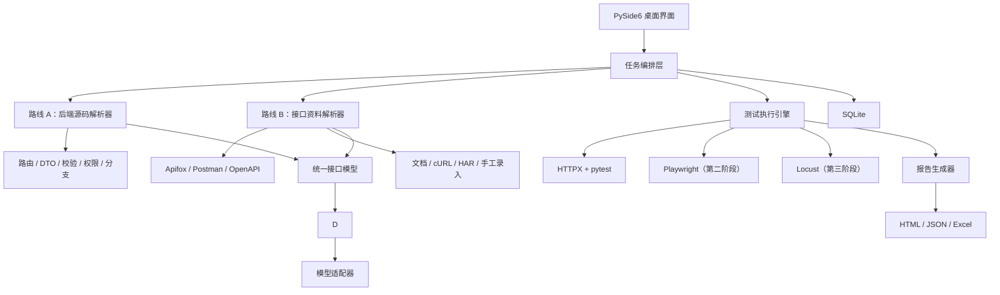

# TestPilot AI 测试智能体工具项目规划（历史版本）

> ⚠️ V3.0 已废止，不再作为开发和验收依据。当前规划基线请查看 [docs/project-plan-v4.0.md](docs/project-plan-v4.0.md)。本文件保留用于追溯早期路线设计。

> 文档用途：项目立项、技术选型、开发排期与 Git 仓库说明  
> 文档版本：V3.0（依赖源码与不依赖源码双路线方案）  
> 产品形态：Windows 桌面工具（EXE，绿色免安装）  
> 主要用户：测试工程师  
> 首要目标：同时提供“依赖后端源码”和“不依赖后端源码”两条独立路线，通过自然语言指令生成接口测试用例、执行测试并输出测试报告

---

## 1. 项目概述

### 1.1 项目定位

TestPilot AI 是一款面向测试工程师的桌面测试智能体工具，接口测试提供两条并列路线：

- **路线 A：源码驱动测试。** 用户导入后端项目代码，工具分析路由、控制器、DTO、校验规则、权限注解、异常分支和数据模型，再生成测试用例。
- **路线 B：资料驱动测试。** 不需要后端代码，用户导入 Apifox、Postman、OpenAPI/Swagger、接口文档、cURL、HAR 或手工接口，再生成测试用例。

两条路线不是谁替代谁，也不是“主功能和可选功能”的关系。用户根据实际能拿到的资料选择其中一条；资料齐全时还可以组合使用并进行代码与文档一致性对比。

无论选择哪条路线，工具都辅助完成：

1. 选择源码驱动或资料驱动模式；
2. 识别接口、参数、鉴权方式和业务约束；
3. 判断当前资料完整程度并提示补充信息；
4. 生成测试计划、测试点和结构化测试用例；
5. 在测试人员确认后执行接口测试；
6. 收集请求、响应、断言、耗时和来源证据；
7. 生成可查看、可导出的测试报告。

### 1.2 产品核心价值

- 减少手工整理接口和编写重复测试用例的时间；
- 有后端源码时能够进行更深入的白盒增强分析；
- 没有后端源码时仍能通过接口资料完成黑盒接口测试；
- 兼容测试人员日常使用的 Apifox、Postman 和 Swagger 资料；
- 让测试工程师通过自然语言快速组织测试任务；
- 自动补充边界值、异常参数、权限和业务规则场景；
- 统一保存项目、环境、用例、执行记录和测试报告；
- 后续可扩展 UI、性能、鲁棒性及安全测试智能体。

### 1.3 第一版应坚持的原则

- 先完成接口测试闭环，不同时开发所有智能体；
- 智能体负责辅助分析，关键测试内容仍允许人工修改和确认；
- 产品必须明确提供“源码驱动”和“资料驱动”两个入口；
- 两条路线最终转换为同一套接口模型、测试用例和执行报告；
- 路线 A 先支持公司常用后端框架，再通过解析插件扩展；
- 路线 B 优先支持 Apifox、Postman 和 OpenAPI/Swagger；
- 资料不完整时必须提示缺失内容，不能让智能体凭空猜测业务规则；
- 所有执行过程必须可查看，不允许智能体“黑盒执行”；
- 每条测试结果必须能追溯到接口、用例、请求、响应和断言；
- 默认只在用户授权的测试环境中执行；
- 默认不上传完整项目源码，只向模型提供完成任务所需的最小内容。

---

## 2. 推荐技术方案

## 2.1 技术选型结论

第一版建议采用：

> **Python 3.12+ + PySide6 + pytest + HTTPX + SQLite + Jinja2**

选择这套方案的主要原因是：

- 接口自动化、UI 自动化、性能测试和数据处理都能使用 Python；
- 测试工程师更容易阅读和维护 Python 代码；
- 不需要同时维护 C#、JavaScript、Rust 和 Python 多套技术栈；
- PySide6 可制作完整的 Windows 桌面界面；
- Qt 官方提供 `pyside6-deploy`，可在 Windows 生成 EXE；
- 后续可以直接接入 pytest、Playwright、Locust、Schemathesis 等测试工具。

Qt 官方说明 `pyside6-deploy` 可以部署 PySide6 桌面应用，并在 Windows 生成 `.exe` 文件：[Qt for Python 部署文档](https://doc.qt.io/qtforpython-6/deployment/deployment-pyside6-deploy.html)。

## 2.2 主要技术与用途

| 模块 | 推荐技术 | 主要用途 |
| --- | --- | --- |
| 编程语言 | Python 3.12+ | 桌面界面、智能体编排、测试执行和报告生成 |
| 桌面界面 | PySide6 / Qt Widgets | 项目管理、用例编辑、执行进度、报告查看 |
| 界面架构 | MVVM 或分层架构 | 分离界面、业务逻辑和数据 |
| 接口请求 | HTTPX | 发送同步/异步 HTTP 请求 |
| 测试执行 | pytest | 测试用例执行、参数化、断言和插件扩展 |
| 接口规范解析 | OpenAPI/Swagger Parser | 识别路径、方法、参数、请求体和响应模型 |
| Apifox 数据导入 | OpenAPI / Postman / Apifox JSON Parser | 读取 Apifox 导出的接口、模型和示例 |
| Postman 数据导入 | Postman Collection v2.1 Parser | 读取 Collection、Environment 和变量 |
| 文档解析 | Markdown/HTML/Excel/Word/PDF Extractor | 从非标准接口文档提取候选接口 |
| 请求记录导入 | cURL / HAR Parser | 从真实请求示例恢复接口信息 |
| 自动异常用例 | Schemathesis | 根据 OpenAPI 生成属性与边界测试 |
| 数据存储 | SQLite + SQLModel/SQLAlchemy | 保存项目、环境、用例、任务和报告 |
| 报告模板 | Jinja2 + HTML/CSS | 生成可独立打开的 HTML 报告 |
| 扩展报告 | Allure（可选） | 输出交互式自动化测试报告 |
| 智能体接入 | OpenAI-compatible Adapter | 统一封装云端或本地模型接口 |
| 配置文件 | YAML / JSON | 保存项目环境、请求头和执行参数 |
| 日志 | Loguru 或标准 logging | 保存运行日志和异常堆栈 |
| 打包 | pyside6-deploy / Nuitka | 生成 Windows EXE 和绿色压缩包 |
| 代码管理 | Git + GitHub/GitLab | 版本管理、Issue、Release 和协作 |
| 自动检查 | GitHub Actions | 执行单元测试、构建和发布压缩包 |

pytest 支持测试参数化，适合让一条接口用例使用多组正常、边界和异常数据执行：[pytest 参数化文档](https://docs.pytest.org/en/stable/how-to/parametrize.html)。

Schemathesis 可以根据 OpenAPI 或 GraphQL 规范生成属性测试，用于发现手工用例容易遗漏的边界问题：[Schemathesis 文档](https://schemathesis.readthedocs.io/)。

SQLite 不需要单独启动数据库服务，数据直接保存在本地文件中，适合绿色桌面软件：[SQLite 官方说明](https://sqlite.org/about.html)。

Apifox 官方支持将 API 导出为 OpenAPI、Apifox、Postman、HTML 和 Markdown 等格式；OpenAPI 可导出为 JSON 或 YAML：[Apifox 导出数据文档](https://docs.apifox.com/export-data)。

Postman 官方支持把 Collection、Environment 和全局变量导出为 JSON 文件：[Postman 导出数据文档](https://learning.postman.com/v11/docs/getting-started/importing-and-exporting/exporting-data)。

## 2.3 为什么第一版不推荐“React + Tauri + Python 服务”

React + Tauri 的界面效果较好，但第一版会同时出现：

- React/TypeScript 前端；
- Rust/Tauri 桌面壳；
- Python 测试服务；
- 前后端通信；
- 多语言打包；
- 三套依赖与调试环境。

对于个人或小团队项目，初期成本较高。

因此第一版建议先使用 PySide6 完成产品闭环。等核心能力稳定、确实需要更高级的界面效果时，再评估是否更换桌面外壳。

---

## 3. 总体架构



## 3.1 分层说明

### 表现层

负责桌面界面，不直接编写测试执行逻辑。

主要页面：

- 首页/工作台；
- 项目管理；
- 接口列表；
- 测试指令；
- 测试用例；
- 执行任务；
- 测试报告；
- 模型与环境设置；
- 系统日志。

### 应用编排层

负责把一次用户操作组织成完整任务：

```text
选择源码驱动或资料驱动
  → 导入后端项目或接口资料
  → 识别接口
  → 用户输入测试指令
  → 智能体生成测试计划
  → 用户确认
  → 生成可执行用例
  → 执行测试
  → 收集结果
  → 生成报告
```

### 智能体层

第一版不需要真正部署多个独立服务，可以在同一个程序中使用多个“职责模块”：

| 智能体/模块 | 职责 |
| --- | --- |
| 模式识别智能体 | 判断当前使用源码驱动、资料驱动还是组合模式 |
| 源码分析智能体 | 分析路由、DTO、校验、权限、异常分支和数据模型 |
| 资料分析智能体 | 判断 Apifox、Postman、Swagger、文档、cURL 等资料类型与完整度 |
| 接口整理智能体 | 统一接口、参数、示例、环境变量和鉴权信息 |
| 测试设计智能体 | 生成测试点、场景和用例 |
| 测试执行智能体 | 调用测试引擎、控制任务和处理失败 |
| 报告分析智能体 | 汇总失败原因、风险和测试结论 |

后续功能变多后，再考虑真正的多智能体并行编排。

### 测试执行层

执行层必须采用确定性代码，不应让大模型直接控制底层请求。

正确方式：

1. 模型生成结构化测试用例；
2. 程序校验测试用例格式；
3. 用户确认执行范围；
4. pytest/HTTPX 按固定规则执行；
5. 程序记录完整请求和响应；
6. 模型只负责对结果进行辅助分析。

## 3.2 双路线总体设计

### 路线 A：依赖后端代码

输入内容：

- 后端项目目录；
- Git 仓库检出后的本地代码；
- 项目配置文件；
- 路由、控制器、DTO/VO、服务层和数据模型；
- 可选的接口文档、测试环境和启动说明。

主要分析：

- 路由路径和 HTTP Method；
- 请求参数、DTO 字段和类型；
- Required、长度、范围、格式和枚举等校验；
- 登录、角色和权限注解；
- 控制器与服务层显式业务分支；
- 异常类型和错误处理；
- 数据模型约束；
- 接口调用依赖；
- 代码变更可能影响的接口；
- 文档与代码不一致项。

优势：

- 能发现文档没有描述的接口和校验；
- 测试用例更接近实际实现；
- 可以提供代码位置和失败关联；
- 后续可以扩展变更影响分析和覆盖率。

限制：

- 必须取得代码读取权限；
- 不同语言和框架需要不同解析插件；
- 静态分析仍不能完全理解所有动态业务逻辑；
- 项目源码需要严格本地处理与权限隔离。

### 路线 B：不依赖后端代码

输入内容：

- Apifox；
- Postman Collection/Environment；
- OpenAPI/Swagger；
- 接口文档；
- cURL；
- HAR；
- 测试地址和请求示例；
- 手工录入接口。

主要分析：

- 接口路径、方法和参数；
- 请求与响应 Schema；
- 环境变量与鉴权；
- 示例数据；
- 文档中的业务规则；
- 真实请求记录；
- 测试人员输入的重点场景。

优势：

- 不需要开发提供代码；
- 适用于第三方系统和跨部门项目；
- 接入简单、使用范围广；
- 更容易先完成可用版本。

限制：

- 无法知道文档未描述的内部代码分支；
- 无法直接计算代码覆盖率；
- 深层业务规则需要测试人员补充；
- 文档过期时可能产生误报。

### 组合模式

当源码和接口资料都有时，同时执行两条路线：

```text
后端源码 ──→ 源码解析 ──┐
                       ├─→ 接口合并与差异检查 ─→ 测试用例
接口资料 ──→ 资料解析 ──┘
```

组合模式重点输出：

- 源码有、文档没有的接口；
- 文档有、源码没有的接口；
- 参数类型和必填规则差异；
- 鉴权与权限差异；
- 响应状态码和错误结构差异；
- 测试用例的来源证据；
- 哪些用例来自代码、文档或用户指令。

### 两条路线的共同底座

| 共同模块 | 说明 |
| --- | --- |
| 统一接口模型 | 屏蔽源码、Apifox、Postman 等来源差异 |
| 测试用例模型 | 使用同一套前置条件、请求、断言、清理结构 |
| 环境与鉴权 | 统一管理 Base URL、Token、Cookie 和变量 |
| 执行引擎 | 统一通过 HTTPX/pytest 执行 |
| 报告系统 | 统一统计通过率、失败原因和风险 |
| 数据库 | 统一保存项目、接口、用例、任务和报告 |
| 安全控制 | 统一进行环境确认、敏感数据脱敏和高风险确认 |

## 3.3 输入资料全场景适配

工具不能假设每个项目都有完整源码或标准 Swagger。第一阶段需要覆盖测试工程师实际可能遇到的各种情况。

### 情况 A：有 Apifox 项目

优先让用户从 Apifox 导出：

1. OpenAPI 3.0/3.1 JSON 或 YAML；
2. Postman 格式；
3. Apifox 格式；
4. Markdown/HTML 离线文档（只作为辅助说明）；
5. 环境、变量和测试账号信息。

处理方式：

- OpenAPI 作为接口结构主数据；
- Apifox/Postman 数据用于补充示例、变量、目录和调试请求；
- 环境地址与敏感变量分开保存；
- 导入后显示接口数量、缺失字段和可测试范围；
- 对同一方法、同一路径的重复接口提示用户处理。

### 情况 B：有 Postman Collection

建议导入：

- Collection v2.1 JSON；
- Environment JSON；
- Globals JSON（可选）；
- 测试账号和鉴权说明；
- Collection 中已有的 Pre-request/Test Script。

处理方式：

- 保留 Collection 文件夹层级作为模块；
- 识别 `{{baseUrl}}` 等变量；
- 导入请求方法、地址、Header、Body 和示例；
- 尝试转换 Postman 断言；
- 无法安全转换的脚本标记为“需人工确认”；
- 环境中的敏感值导入后立即加密或要求重新输入。

### 情况 C：有 OpenAPI/Swagger

支持：

- OpenAPI 3.0/3.1 JSON；
- OpenAPI 3.0/3.1 YAML；
- Swagger 2.0；
- 本地文件；
- 在线文档地址；
- 直接粘贴原始内容。

可自动获得：

- Path 和 HTTP Method；
- Query、Path、Header、Cookie 参数；
- Request Body；
- Response Schema；
- 枚举、格式、必填、最小值、最大值和长度限制；
- Security Scheme；
- 接口 Tags 和 OperationId。

OpenAPI 可以描述端点、操作、参数、输入输出和鉴权方式：[OpenAPI/Swagger 说明](https://swagger.io/docs/specification/v3_0/about/)。

### 情况 D：只有接口文档

文档可能是：

- Markdown；
- HTML；
- Excel；
- Word；
- PDF；
- Wiki 页面复制内容；
- 聊天记录或纯文本说明；
- 截图或扫描件。

处理方式：

1. 解析文档文本；
2. 提取候选接口；
3. 显示“待确认接口草稿”；
4. 由用户确认方法、路径、参数和响应；
5. 保存为工具内部标准格式；
6. 确认完成后才允许批量执行。

限制：

- 文档没有写出的必填、长度和业务规则无法自动确定；
- PDF/截图识别结果必须人工复核；
- 不能只凭字段名称猜测生产级断言；
- 接口文档不完整时，测试结论需要标注覆盖范围。

### 情况 E：只有接口地址或 cURL

输入可能是：

- 单个完整 URL；
- 一条或多条 cURL；
- 浏览器开发者工具复制的请求；
- 请求方法、Header、Body 的文字描述；
- 一个可以成功执行的请求示例。

处理方式：

- 解析方法、URL、Query、Header、Cookie 和 Body；
- 把敏感 Header 自动识别为变量；
- 根据成功响应推断候选字段结构；
- 创建“示例驱动接口”；
- 让用户补充必填、边界、权限和错误响应；
- 支持逐个接口扩充为项目。

### 情况 F：只有测试环境，没有正式接口资料

这种情况不能直接进行大范围自动探索。

可采用：

- 手工创建接口；
- 粘贴 cURL；
- 从浏览器导入 HAR；
- 从前端实际操作中记录网络请求；
- 由测试人员选择允许记录的域名；
- 从已有测试日志提取请求样例。

工具必须禁止：

- 未授权扫描路径；
- 自动枚举未知接口；
- 对生产环境进行探测；
- 未经确认执行写入、删除或批量修改请求。

### 情况 G：有后端源码

进入路线 A，源码是该路线的主要输入：

- 扫描路由和控制器；
- 对比源码接口与接口文档；
- 找出未写入文档的接口；
- 分析显式参数校验；
- 识别权限注解；
- 定位接口实现文件；
- 生成正常、异常、边界、权限和分支测试用例；
- 关联接口与代码位置；
- 为后续变更影响分析和覆盖率提供基础。

限制：

- 路线 A 第一版不承诺支持所有框架；
- 优先支持公司常用框架；
- 不能把静态源码分析结果直接当成最终业务规则；
- 源码默认本地处理，不上传完整代码。

### 情况 H：同时有 Apifox/Postman、接口文档和源码

进入组合模式，工具需要进行差异对比：

- 文档中存在、实际资料中不存在；
- 源码中存在、文档中不存在；
- 参数名称或类型不一致；
- 请求示例与 Schema 不一致；
- 状态码和错误结构不一致；
- 鉴权说明不一致；
- 环境变量缺失；
- 已删除接口仍在 Collection 中。

最终生成“接口资料一致性报告”，由测试人员选择可信来源。

### 情况 I：资料非常不完整

工具先输出资料完整度，不立即声称可以全面测试。

建议分级：

| 完整度 | 资料情况 | 可执行范围 |
| --- | --- | --- |
| A | 有规范、环境、鉴权、示例、业务规则 | 可生成较完整测试 |
| B | 有规范、环境和鉴权 | 可生成参数、结构、鉴权用例 |
| C | 有 URL/cURL 和成功示例 | 可做示例驱动与基础异常测试 |
| D | 只有文字文档 | 只能生成草稿，需人工确认 |
| E | 只有系统地址 | 不能自动探索，需补充接口资料 |

### 统一处理原则

无论输入来自哪里，最终都要转换成统一的内部接口模型：

```text
接口来源
  → 格式识别
  → 字段提取
  → 变量与敏感数据识别
  → 完整度评分
  → 缺失信息提问
  → 人工确认
  → 标准接口模型
  → 测试用例生成
```

---

## 4. 项目目录建议

```text
testpilot-ai/
├─ README.md
├─ pyproject.toml
├─ requirements/
│  ├─ base.txt
│  ├─ dev.txt
│  └─ build.txt
├─ src/
│  └─ testpilot/
│     ├─ main.py
│     ├─ app/
│     │  ├─ bootstrap.py
│     │  ├─ container.py
│     │  └─ settings.py
│     ├─ ui/
│     │  ├─ windows/
│     │  ├─ pages/
│     │  ├─ widgets/
│     │  ├─ dialogs/
│     │  └─ resources/
│     ├─ domain/
│     │  ├─ project.py
│     │  ├─ api.py
│     │  ├─ test_case.py
│     │  ├─ test_run.py
│     │  └─ report.py
│     ├─ agents/
│     │  ├─ project_analyzer.py
│     │  ├─ case_designer.py
│     │  ├─ execution_coordinator.py
│     │  ├─ report_analyzer.py
│     │  ├─ prompts/
│     │  └─ schemas/
│     ├─ model_providers/
│     │  ├─ base.py
│     │  ├─ openai_compatible.py
│     │  └─ local_model.py
│     ├─ parsers/
│     │  ├─ apifox_parser.py
│     │  ├─ openapi_parser.py
│     │  ├─ postman_parser.py
│     │  ├─ postman_environment_parser.py
│     │  ├─ curl_parser.py
│     │  ├─ har_parser.py
│     │  ├─ document_parser.py
│     │  ├─ format_detector.py
│     │  ├─ completeness_checker.py
│     │  └─ source_plugins/
│     ├─ engines/
│     │  ├─ api_engine/
│     │  ├─ ui_engine/
│     │  ├─ performance_engine/
│     │  ├─ robustness_engine/
│     │  └─ security_engine/
│     ├─ reports/
│     │  ├─ generator.py
│     │  ├─ templates/
│     │  └─ exporters/
│     ├─ storage/
│     │  ├─ database.py
│     │  ├─ models.py
│     │  └─ repositories/
│     └─ common/
│        ├─ logging.py
│        ├─ errors.py
│        └─ security.py
├─ tests/
│  ├─ unit/
│  ├─ integration/
│  └─ fixtures/
├─ examples/
│  ├─ openapi/
│  └─ demo-project/
├─ scripts/
│  ├─ build_windows.ps1
│  └─ create_release.ps1
├─ docs/
│  ├─ architecture.md
│  ├─ user-guide.md
│  └─ development.md
└─ .github/
   └─ workflows/
      ├─ test.yml
      └─ release-windows.yml
```

---

## 5. 第一阶段：接口测试智能体 MVP

## 5.1 阶段目标

完成最重要的一条产品链路：

> 导入接口 → 输入测试指令 → 生成测试用例 → 人工确认 → 执行测试 → 生成报告

第一阶段完成后，工具应该可以交给其他测试人员试用，而不是只有演示界面。

## 5.2 第一阶段输入方式

按优先级实现：

1. Apifox 导出的 OpenAPI JSON/YAML；
2. Apifox 导出的 Postman/Apifox 数据；
3. Postman Collection v2.1；
4. Postman Environment/Globals；
5. OpenAPI/Swagger 本地文件或在线地址；
6. cURL、原始 HTTP 请求；
7. 手工添加接口；
8. Markdown/HTML/Excel/Word/PDF 接口文档；
9. HAR 网络请求记录；
10. 后端项目源码。

上述输入分为两组：

- 路线 A：第 10 项，依赖后端代码；
- 路线 B：第 1～9 项，不依赖后端代码。

两个入口在产品中并列展示，不能把其中一个隐藏成附属功能。

### 导入后的资料检查

每次导入后必须显示：

- 识别到的接口数量；
- 支持和不支持的协议；
- 接口模块数量；
- 缺少 Base URL 的接口；
- 缺少请求示例的接口；
- 缺少响应 Schema 的接口；
- 缺少鉴权说明的接口；
- 存在敏感变量的数量；
- 解析失败或需要人工确认的内容；
- 当前资料完整度等级；
- 建议补充的信息。

### 资料不足时需要询问的内容

- 正常业务结果是什么；
- 必填字段有哪些；
- 字段长度、范围和枚举值；
- 成功与失败状态码；
- 使用 Bearer Token、Cookie、API Key 还是其他鉴权；
- 需要哪些角色和权限；
- 是否会新增、修改或删除数据；
- 测试数据如何准备；
- 测试完成后是否需要清理数据；
- 是否允许执行异常和重复提交测试；
- 当前地址是否为测试环境。

### 路线 A 的源码识别顺序

不建议第一版直接支持所有后端框架。

建议先支持公司最常用的两个框架，例如：

- ASP.NET Core Web API；
- Java Spring Boot。

后续再增加：

- Python FastAPI；
- Node.js Express/NestJS；
- Go Gin；
- 其他框架。

源码驱动模式建议先支持公司最常用的一个后端框架，把路由、DTO、校验和权限链路做完整，再增加第二个框架。若项目同时提供 Swagger，则进入组合模式，自动对比 Swagger 与源码。

## 5.3 第一阶段接口测试内容

| 测试类型 | 需要检查的内容 | 示例 |
| --- | --- | --- |
| 正常功能 | 正确参数能否返回预期结果 | 正确账号密码登录成功 |
| 必填参数 | 缺少必填字段时是否正确拦截 | 不传 username |
| 参数类型 | 字符串、数字、布尔、数组类型错误 | age 传入 `"abc"` |
| 等价类 | 有效类和无效类数据 | 合法手机号与非法手机号 |
| 边界值 | 最小值、最大值、临界值、越界值 | 长度 0、1、49、50、51 |
| 空值处理 | null、空字符串、空数组、空对象 | password 为 `""` |
| 特殊字符 | 空格、中文、Emoji、转义字符 | 名称包含 `'`、`"`、`\` |
| 请求头 | Content-Type、Accept、自定义 Header | 缺少 token |
| 鉴权认证 | 未登录、Token 失效、Token 篡改 | 过期 JWT |
| 权限控制 | 不同角色是否只能访问授权资源 | 普通用户访问管理员接口 |
| 响应状态码 | 状态码是否符合接口约定 | 成功 200、创建 201 |
| 响应结构 | 字段、类型和层级是否符合规范 | id 应为整数 |
| 业务规则 | 状态流转和业务限制是否正确 | 已关闭订单不能付款 |
| 重复提交 | 重复请求是否造成重复数据 | 连续提交同一订单 |
| 幂等性 | PUT/DELETE 等重复执行结果 | 重复删除同一资源 |
| 数据一致性 | 接口执行后数据状态是否正确 | 新增后查询能够查到 |
| 异常处理 | 服务异常时是否返回统一错误 | 数据库异常不泄露堆栈 |
| 响应时间基线 | 单接口是否超过基础阈值 | 响应大于 2 秒标记风险 |
| 重定向 | 3xx 跳转是否符合预期 | 登录失效跳转统一入口 |
| Cookie/Session | 会话创建、刷新和失效 | 退出后 Session 不能继续使用 |
| 文件上传 | 类型、大小、空文件、重复文件 | 上传超大或非法扩展名 |
| 文件下载 | 状态码、文件名、类型和内容 | 下载文件为空或损坏 |
| 分页 | 页码、每页数量、总数和越界 | page=0、超出最大页 |
| 排序与筛选 | 条件组合、非法字段和默认规则 | 多条件筛选结果错误 |
| 前后置依赖 | 上一接口输出能否供下一接口使用 | 登录 Token 用于查询接口 |
| 数据清理 | 执行后是否恢复测试环境 | 新增数据测试后自动删除 |

注意：第一阶段的“响应时间基线”只记录单请求耗时，不等同于正式性能测试。

### 路线 A 额外生成的测试内容

| 源码信息 | 可生成的测试 |
| --- | --- |
| 路由与控制器 | 未文档化接口、Method/Path 一致性 |
| DTO/VO 字段 | 类型、必填、空值和组合字段测试 |
| 长度/范围注解 | 精确边界值与越界测试 |
| 枚举与常量 | 合法值、非法值和大小写测试 |
| 权限注解 | 未登录、不同角色和越权测试 |
| Service 条件分支 | 业务状态与异常分支测试 |
| Exception 处理 | 错误码、错误信息和异常泄露测试 |
| 数据模型 | 唯一性、非空、关联与数据一致性测试 |
| 代码变更 Diff | 回归测试范围建议 |

### 路线 B 主要生成的测试内容

| 资料信息 | 可生成的测试 |
| --- | --- |
| OpenAPI Schema | 参数、类型、必填、枚举和响应结构测试 |
| Postman/Apifox 示例 | 正常请求、变量和基础断言 |
| cURL/HAR | 请求复现、Header、Cookie 和基础异常测试 |
| 接口文档 | 文档明确描述的业务规则测试 |
| 用户指令 | 指定模块、风险点和业务场景测试 |

两条路线生成的用例都必须标注来源，例如 `source_code`、`openapi`、`postman`、`document` 或 `user_instruction`。

## 5.4 测试用例结构

每条测试用例至少包含：

```yaml
id: TC-AUTH-001
name: 用户使用正确账号密码登录
module: 用户认证
priority: P0
tags:
  - 功能
  - 登录
preconditions:
  - 测试用户已存在且状态正常
request:
  method: POST
  path: /api/auth/login
  headers:
    Content-Type: application/json
  body:
    username: test_user
    password: ${SECRET_PASSWORD}
assertions:
  - type: status_code
    expected: 200
  - type: json_path
    path: $.data.token
    operator: not_empty
  - type: response_time
    operator: less_than
    expected: 2000
cleanup: []
source: agent_generated
review_status: confirmed
```

密码、Token 等敏感数据不能直接写入用例，应引用环境变量或加密配置。

## 5.5 第一阶段功能模块

### A. 项目管理

- 新建、打开、删除测试项目；
- 记录项目名称、路径、接口来源和更新时间；
- 保存不同项目的测试环境；
- 支持项目最近打开记录。

### B. 接口管理

- 导入 Apifox 导出文件；
- 导入 Postman Collection 和 Environment；
- 导入 OpenAPI/Swagger；
- 导入 cURL 和 HAR；
- 从文档提取接口草稿；
- 展示接口路径、方法、模块、参数和请求体；
- 搜索和筛选接口；
- 手工编辑接口信息；
- 标记暂不测试的接口；
- 检测接口规范更新。

### C. 环境管理

- 配置开发、测试、预发布环境；
- 配置 Base URL；
- 配置公共 Header；
- 配置 Cookie、Token 和环境变量；
- 敏感值本地加密；
- 一键验证环境是否可访问。

需要支持的常见鉴权方式：

- 无鉴权；
- Basic Auth；
- Bearer Token/JWT；
- API Key；
- Cookie/Session；
- OAuth 2.0 手工 Token；
- 登录接口提取 Token；
- 自定义 Header；
- 签名参数（插件扩展）。

### C1. 变量与接口依赖

- 全局变量、环境变量、项目变量和临时变量；
- 从 JSONPath 提取响应字段；
- 从 Header/Cookie 提取值；
- 将上一步结果传给下一步；
- 动态时间戳、随机数和唯一标识；
- 数据驱动参数；
- 前置数据准备；
- 后置数据清理；
- 依赖失败时跳过后续步骤；
- 敏感变量不显示明文。

### D. 智能测试指令

用户可以输入：

```text
为用户模块的登录、注册和用户信息查询接口生成测试用例。
重点检查必填参数、边界值、错误密码、Token 失效和越权访问，
执行后输出失败原因及风险等级。
```

智能体需要先输出测试计划，不立即执行：

```text
计划测试接口：8 个
预计生成用例：56 条
测试类型：正常功能、参数校验、边界值、鉴权、权限
不包含：压力测试、破坏性数据操作
```

用户确认后，再生成并执行用例。

### E. 测试用例管理

- 查看智能体生成的测试用例；
- 新增、修改、复制和删除用例；
- 批量调整优先级和标签；
- 勾选本次需要执行的用例；
- 保存人工修改记录；
- 区分“智能体生成”和“人工创建”。

### F. 测试执行

- 实时显示当前接口和用例；
- 支持停止任务；
- 支持失败后继续执行；
- 支持设置超时时间；
- 支持有限并发；
- 保存请求、响应、断言和耗时；
- 对响应中的密码、Token 等字段进行脱敏；
- 区分通过、失败、错误、跳过。

### G. 测试报告

报告至少包含：

- 项目信息；
- 测试环境；
- 执行时间；
- 接口数量；
- 用例总数；
- 通过、失败、错误、跳过数量；
- 通过率；
- 各模块执行情况；
- 各接口响应时间；
- 失败用例详情；
- 请求和响应摘要；
- 失败原因分析；
- 风险等级；
- 测试结论；
- HTML、JSON 导出。

Allure 可以与 pytest 集成，用于生成包含步骤、附件、断言差异和历史趋势的交互式报告：[Allure pytest 文档](https://allurereport.org/docs/pytest/)。

## 5.6 第一阶段拆分

### 1A：桌面框架与基础数据

- PySide6 主窗口；
- 左侧导航；
- 项目管理；
- SQLite 初始化；
- 日志系统；
- 设置页面；
- 基础异常处理。

交付结果：能够新建项目并保存配置。

### 1B：路线 B——不依赖源码的接口导入

- Apifox 导出数据解析；
- Postman Collection/Environment 解析；
- OpenAPI/Swagger 解析；
- cURL 解析；
- 接口列表；
- 参数详情；
- 资料完整度检查；
- 环境配置；
- 单接口手工发送请求。

交付结果：在没有后端代码的情况下，能够导入接口并完成类似 Postman 的基础请求。

### 1C：路线 A——后端源码解析

- 选择本地后端项目；
- 识别项目语言和框架；
- 解析路由和控制器；
- 解析 DTO、参数校验和枚举；
- 解析鉴权与权限注解；
- 解析显式异常分支；
- 生成统一接口模型；
- 显示源码位置与解析证据；
- 支持至少一个公司常用框架。

交付结果：在有后端代码的情况下，能够从源码识别接口和测试约束。

### 1D：智能体生成测试用例

- 模型配置；
- Prompt 模板；
- 结构化 JSON 输出；
- 用例格式校验；
- 测试计划预览；
- 用例人工确认与修改。

交付结果：能够根据接口和用户指令生成结构化测试用例。

### 1E：批量执行与测试报告

- pytest/HTTPX 执行引擎；
- 断言引擎；
- 任务进度；
- 请求响应记录；
- 报告生成；
- HTML/JSON 导出。

交付结果：完成接口测试闭环。

### 1F：组合模式、补充输入与 EXE 打包

- Markdown/HTML/Excel 接口文档导入；
- HAR 请求记录导入；
- 重复接口和资料差异提示；
- Postman 环境变量导入；
- 源码与接口资料差异对比；
- 用例来源标记；
- Nuitka/pyside6-deploy 打包；
- Windows 绿色压缩包；
- 用户使用说明；
- Git Release 流程。

交付结果：可以把压缩包交给其他测试人员试用。

## 5.7 第一阶段验收标准

- 能成功导入 Apifox 导出的 OpenAPI 文件；
- 能导入 Postman Collection v2.1 和 Environment；
- 能成功导入标准 OpenAPI 3.x 和 Swagger 2.0 文件；
- 能通过 cURL 创建接口；
- 能选择“依赖后端代码”和“不依赖后端代码”两种模式；
- 路线 A 能从至少一个后端框架识别路由、参数校验和权限信息；
- 路线 B 能在没有源码时完成接口导入、用例生成、执行和报告；
- 组合模式能输出源码与接口资料差异；
- 能展示接口、参数、请求体和响应模型；
- 能显示资料完整度和待补充信息；
- 能保存至少三套环境配置；
- 能根据自然语言指令生成结构化测试用例；
- 生成用例前能预览测试计划；
- 用户能够修改和确认用例；
- 能执行正常、参数、边界、鉴权和权限类接口用例；
- 能保存完整执行记录并对敏感字段脱敏；
- 能生成独立 HTML 测试报告；
- 软件重启后项目、用例和报告仍然存在；
- 能打包为 Windows 绿色版；
- 普通用户不安装 Python 也能运行。

路线 A 验收需要后端源码；路线 B 验收不需要后端源码。两条路线分别验收，不能用一条路线代替另一条路线。

## 5.8 第一阶段不做的内容

- 不解析所有编程语言和后端框架；
- 不要求路线 B 提供源码；
- 不允许路线 A 在用户未授权时读取项目目录之外的代码；
- 不保证自动理解文档中没有写出的业务规则；
- 不对未知系统自动扫描接口；
- 不自动操作生产环境；
- 不执行高并发压力测试；
- 不执行入侵式安全扫描；
- 不让大模型跳过人工确认直接执行删除、修改类接口；
- 不做多人协同与云端项目管理；
- 不开发复杂插件市场。

---

## 5.9 第一阶段支持范围

### 首版支持的接口协议

第一版只把 HTTP/HTTPS REST API 做完整：

- GET；
- POST；
- PUT；
- PATCH；
- DELETE；
- HEAD；
- OPTIONS。

首版支持的请求数据：

- Query 参数；
- Path 参数；
- Header；
- Cookie；
- JSON；
- `application/x-www-form-urlencoded`；
- `multipart/form-data`；
- 文本请求体；
- 文件上传；
- 文件下载。

后续协议扩展：

| 协议 | 建议阶段 | 主要测试内容 |
| --- | --- | --- |
| GraphQL | 接口 MVP 稳定后 | Query、Mutation、变量、错误结构、权限 |
| WebSocket | 接口 MVP 稳定后 | 连接、鉴权、订阅、消息、断线重连 |
| gRPC | 独立扩展阶段 | Proto、Metadata、Unary、Stream、错误码 |
| SSE | 独立扩展阶段 | 建连、事件格式、心跳、断开重连 |
| Dubbo 等内部协议 | 插件阶段 | 根据公司实际技术栈实现 |

不要在第一版同时实现所有协议，否则接口测试闭环会被拖慢。

### 输入格式与首版处理能力

| 输入资料 | 首版能力 | 处理结果 |
| --- | --- | --- |
| Apifox OpenAPI JSON/YAML | 完整支持 | 生成标准接口模型 |
| Apifox Postman 格式 | 支持 | 导入接口、示例和变量 |
| Apifox 原生格式 | 基础支持 | 解析常用接口数据，不支持项提示 |
| Postman Collection v2.1 | 完整支持 | 保留目录、请求、示例和变量 |
| Postman Environment | 完整支持 | 导入环境变量并识别敏感值 |
| Swagger 2.0 | 支持 | 转换成内部标准模型 |
| OpenAPI 3.0/3.1 | 完整支持 | 读取 Schema、参数、响应和鉴权 |
| cURL | 完整支持 | 创建单接口或批量接口 |
| HAR | 基础支持 | 从已发生请求创建接口草稿 |
| Markdown/HTML | 基础支持 | 提取接口草稿，人工确认 |
| Excel | 基础支持 | 按字段映射导入接口草稿 |
| Word/PDF | 辅助支持 | 提取文本后人工确认 |
| 截图/扫描件 | 后续支持 | OCR 后生成候选内容 |
| 后端源码 | 路线 A 完整支持 | 解析路由、校验、权限、分支和数据模型 |
| 只有测试网站 | 不自动扫描 | 需要 HAR、cURL 或手工录入 |

### Postman 脚本兼容策略

Postman 的 Pre-request Script 和 Tests 可能包含任意 JavaScript，第一版不能直接全部执行。

建议分为：

1. 可转换规则：变量赋值、简单状态码断言、JSON 字段断言；
2. 需人工确认：复杂条件、循环、动态加密和第三方库；
3. 禁止自动执行：文件访问、网络外连、未知代码和危险操作。

导入时需要显示转换结果：

```text
成功转换：18 条
需要人工确认：5 条
不支持：2 条
```

### 不同资料情况下的测试能力

| 当前资料 | 可以自动完成 | 需要测试人员补充 |
| --- | --- | --- |
| 完整 OpenAPI + 环境 + 账号 | 参数、结构、鉴权、边界、执行 | 深层业务规则 |
| Postman Collection + Environment | 请求复现、变量、基础断言 | 字段约束和预期结果 |
| Apifox + 业务说明 | 大部分接口用例和执行 | 特殊数据准备 |
| 只有接口文档 | 生成测试点和接口草稿 | 地址、鉴权、示例、预期 |
| 只有 cURL | 复现请求、基础异常用例 | 参数含义和业务规则 |
| 只有 HAR | 恢复已发生请求 | 可变参数、鉴权和预期 |
| 有源码无文档 | 路由候选和显式校验 | 环境、业务规则和测试数据 |
| 只有系统地址 | 无法安全自动完成 | 必须补充接口资料或录制请求 |

## 5.10 五种典型使用流程

### 流程一：测试人员使用 Apifox

```text
Apifox 导出 OpenAPI/Postman
  → 导入 TestPilot AI
  → 导入或配置测试环境
  → 选择接口模块
  → 输入测试要求
  → 生成并确认用例
  → 执行
  → 输出报告
```

### 流程二：测试人员使用 Postman

```text
导出 Collection v2.1
  → 导出 Environment
  → 同时导入
  → 检查变量与脚本转换结果
  → 补充预期结果
  → 生成并执行用例
```

### 流程三：只有接口文档和测试地址

```text
导入文档
  → 提取接口草稿
  → 人工确认方法、路径、参数
  → 配置测试地址和鉴权
  → 先发送一次基准请求
  → 生成异常和边界用例
  → 执行并报告
```

### 流程四：有后端源码

```text
选择“依赖后端代码”
  → 导入后端项目目录
  → 识别语言与框架
  → 解析路由、DTO、校验、权限和异常
  → 生成接口模型和测试用例
  → 测试人员确认
  → 执行并输出报告
```

### 流程五：源码与接口资料组合

```text
同时导入后端源码和 Apifox/Postman/Swagger
  → 分别解析
  → 对比接口、参数、鉴权和响应差异
  → 测试人员选择可信来源
  → 合并生成测试用例
  → 执行并输出一致性报告
```

---

## 6. 第二阶段：UI 自动化测试智能体

## 6.1 阶段目标

用户输入网站地址或导入前端项目，描述业务流程，智能体生成并执行 UI 自动化测试。

推荐使用 Playwright Python。Playwright 支持 Chromium、Firefox 和 WebKit，并提供自动等待和面向页面状态的断言：[Playwright Python 文档](https://playwright.dev/python/docs/intro)。

第二阶段不要求拿到前端源码。只要有可访问的测试网站、测试账号和业务流程说明，就可以生成浏览器自动化用例；前端源码仅用于辅助分析页面路由、组件和稳定定位属性。

## 6.2 UI 测试内容

- 页面能否正常打开；
- 登录、注册、查询、新增、修改、删除等业务流程；
- 表单必填校验；
- 输入长度和格式校验；
- 按钮可用状态；
- 弹窗、提示和错误信息；
- 页面跳转和返回；
- 表格搜索、筛选、分页、排序；
- 文件上传与下载；
- 不同角色页面权限；
- Chromium、Firefox、WebKit 兼容性；
- 常用分辨率适配；
- 元素缺失或页面异常截图；
- 执行 Trace、视频和网络日志保存。

## 6.3 主要功能

- 输入目标网站和登录信息；
- 录制或描述操作流程；
- 智能体生成页面对象和测试步骤；
- 元素定位器自动推荐；
- 用例执行前人工确认；
- 失败自动截图；
- 保存 Playwright Trace；
- 输出 UI 自动化测试报告；
- 对不稳定定位器进行提示；
- 支持复用登录状态。

## 6.4 第二阶段验收标准

- 能完成至少一个完整业务流程的自动化测试；
- 能在 Chromium 上稳定重复执行；
- 失败时自动保存截图和 Trace；
- 能区分定位失败、断言失败、网络失败和脚本错误；
- 用例可以再次编辑和执行；
- UI 报告与接口报告使用统一项目和任务结构。

---

## 7. 第三阶段：性能与鲁棒性测试智能体

第三阶段建议分为 3A 性能测试和 3B 鲁棒性测试。

## 7.1 3A：性能测试智能体

推荐使用 Locust。Locust 使用 Python 编写用户行为，并支持分布式负载生成：[Locust 官方文档](https://docs.locust.io/)。

### 性能测试内容

- 单接口基准测试；
- 并发用户测试；
- 负载递增测试；
- 稳定性测试；
- 峰值测试；
- 突发流量测试；
- 吞吐量；
- 平均响应时间；
- P50、P90、P95、P99；
- 错误率；
- 每秒请求数；
- 性能阈值判断。

### 智能体功能

- 根据接口用例生成 Locust 脚本；
- 根据目标并发数生成测试计划；
- 测试前计算风险并要求确认；
- 实时展示吞吐量、响应时间和错误率；
- 自动分析性能拐点；
- 生成性能测试报告；
- 支持导出 Locust 脚本。

### 安全限制

- 默认禁止对生产环境执行；
- 首次执行必须确认目标地址；
- 限制最大并发；
- 支持紧急停止；
- 记录操作者、时间和目标；
- 对内网和外网地址显示不同风险提示。

## 7.2 3B：鲁棒性测试智能体

### 鲁棒性测试内容

- 网络超时；
- 连接中断；
- 延迟响应；
- 重复请求；
- 请求乱序；
- 返回空数据；
- 返回超大数据；
- 非法 JSON；
- 错误 Content-Type；
- 服务返回 4xx/5xx；
- 依赖服务不可用；
- Token 突然失效；
- 接口限流；
- 重试机制；
- 熔断与降级；
- 服务恢复后的状态一致性。

### 验收标准

- 能从已有接口用例生成性能脚本；
- 能展示实时性能指标；
- 能通过阈值判断测试是否通过；
- 能模拟常见网络和响应异常；
- 能输出性能风险和鲁棒性问题清单。

---

## 8. 第四阶段：安全测试智能体

安全测试只允许在明确授权的系统和测试环境中使用。

## 8.1 测试内容

- 身份认证缺陷；
- Token 失效与篡改；
- 越权访问；
- 未授权接口；
- 敏感信息泄露；
- 错误信息泄露；
- 弱密码策略；
- SQL 注入基础检查；
- XSS 基础检查；
- 文件上传类型与大小校验；
- 路径遍历基础检查；
- CORS 配置；
- 安全响应头；
- 接口限流；
- 日志中的敏感信息；
- 依赖组件风险清单。

## 8.2 实现建议

- 优先做非破坏性规则检查；
- 使用 OWASP ZAP 基线扫描作为可选执行器；
- 对所有攻击性测试显示风险等级；
- 执行前要求用户确认目标和授权；
- 默认限制扫描强度；
- 不保存明文密码、Token 和敏感响应；
- 报告中提供复现步骤与修复建议。

## 8.3 第四阶段验收标准

- 能对接口鉴权和权限场景进行自动检查；
- 能输出安全问题、证据、风险等级和修复建议；
- 能阻止未确认的高风险扫描；
- 能对报告中的敏感内容进行脱敏。

---

## 9. 第五阶段：团队化与平台能力

在前四个阶段稳定后，再考虑：

- 多测试项目统一管理；
- 测试模板库；
- 用例版本管理；
- 智能体插件机制；
- Jenkins/GitHub Actions/GitLab CI 集成；
- 定时测试任务；
- 测试结果趋势；
- 缺陷系统对接；
- 团队共享配置；
- 权限和审计日志；
- 本地模型支持；
- 内网部署版本；
- Web 管理端。

这一阶段不是当前 MVP 的必要内容。

---

## 10. 数据设计

## 10.1 核心数据表

| 数据表 | 用途 |
| --- | --- |
| projects | 测试项目 |
| api_sources | Swagger、Postman、源码等接口来源 |
| api_endpoints | 接口定义 |
| environments | 测试环境 |
| secrets | 加密后的敏感配置 |
| test_plans | 测试计划 |
| test_cases | 测试用例 |
| test_steps | 用例步骤与断言 |
| test_runs | 执行任务 |
| test_results | 单条用例结果 |
| request_records | 请求与响应记录 |
| reports | 报告信息 |
| agent_sessions | 智能体会话与任务上下文 |
| audit_logs | 关键操作审计 |

## 10.2 状态设计

### 测试用例状态

```text
草稿 → 待确认 → 已确认 → 已执行 → 已归档
```

### 执行任务状态

```text
等待中 → 准备中 → 执行中 → 已停止 / 已完成 / 执行失败
```

---

## 11. 智能体输出规范

大模型必须返回结构化 JSON，不直接返回不可解析的长文本。

示例：

```json
{
  "plan": {
    "scope": ["用户认证", "用户信息"],
    "test_types": ["正常功能", "参数校验", "边界值", "鉴权"],
    "excluded": ["性能测试", "破坏性操作"]
  },
  "cases": [
    {
      "name": "错误密码登录",
      "priority": "P0",
      "method": "POST",
      "path": "/api/auth/login",
      "body": {
        "username": "test_user",
        "password": "wrong_password"
      },
      "assertions": [
        {
          "type": "status_code",
          "expected": 401
        }
      ]
    }
  ]
}
```

程序接收到模型输出后，需要执行：

1. JSON Schema 校验；
2. 接口是否存在校验；
3. HTTP 方法校验；
4. 参数类型校验；
5. 危险操作识别；
6. 敏感字段识别；
7. 用户确认；
8. 转换为执行引擎对象。

---

## 12. 模型接入设计

## 12.1 模型适配器

不要在业务代码中直接绑定单一模型厂商。

统一定义：

```python
class ModelProvider:
    def generate_structured(
        self,
        system_prompt: str,
        user_prompt: str,
        output_schema: dict
    ) -> dict:
        ...
```

这样后续可以接入：

- OpenAI-compatible API；
- 企业内部模型；
- 本地模型；
- 其他支持结构化输出的模型。

## 12.2 提供给模型的内容

只提供完成任务所需的信息：

- 接口路径和方法；
- 参数定义；
- 请求体 Schema；
- 响应 Schema；
- 用户选择的相关业务代码；
- 用户输入的测试要求；
- 已有测试用例摘要。

默认不发送：

- 完整项目压缩包；
- 数据库密码；
- 私钥；
- `.env` 文件；
- Token；
- 与测试无关的源码；
- 用户个人文件。

## 12.3 智能体安全

- 对删除、修改、批量操作接口标记为高风险；
- 高风险用例执行前再次确认；
- 默认禁止访问生产地址；
- 模型不能直接调用操作系统命令；
- 所有工具调用使用白名单；
- 限制可读取的项目目录；
- 记录生成内容和执行记录；
- 报告和日志自动脱敏。

---

## 13. EXE 打包与发布方式

## 13.1 推荐交付形式

第一版采用绿色压缩包：

```text
TestPilotAI-v0.1.0-win-x64.zip
├─ TestPilotAI.exe
├─ runtime/
├─ plugins/
├─ templates/
├─ config/
├─ LICENSE
├─ README.md
└─ 用户使用说明.pdf
```

用户操作：

```text
下载压缩包 → 解压 → 双击 TestPilotAI.exe → 新建测试项目
```

## 13.2 打包注意事项

- 优先使用 standalone/one-folder 模式，便于排查依赖问题；
- 核心功能稳定后再考虑单文件 EXE；
- 不依赖用户电脑预装 Python；
- 浏览器自动化阶段需要处理 Playwright 浏览器文件；
- 第三方工具许可证需要随发布包说明；
- 每次 Release 生成版本号和变更记录；
- 在干净的 Windows 虚拟机中验证安装包。

---

## 14. Git 仓库管理

## 14.1 分支建议

| 分支 | 用途 |
| --- | --- |
| main | 可发布版本 |
| develop | 日常集成 |
| feature/* | 新功能 |
| fix/* | 缺陷修复 |
| release/* | 发布准备 |

个人开发初期也可以只使用：

```text
main + feature/*
```

避免一开始设计过于复杂的分支流程。

## 14.2 Commit 示例

```text
feat: 支持导入 OpenAPI 文件
feat: 新增接口测试用例生成
fix: 修复 Token 变量未替换问题
test: 增加 OpenAPI 解析器单元测试
docs: 更新 Windows 使用说明
build: 增加 EXE 打包脚本
```

## 14.3 Release 内容

每个版本至少提供：

- Windows 压缩包；
- 版本变更说明；
- 已知问题；
- 支持的接口规范和后端框架；
- 数据升级说明；
- 文件校验值。

---

## 15. 开发排期建议

以下排期按一人主导、业余或非全职开发估算，实际时间需要根据每天可投入时间调整。

| 阶段 | 建议周期 | 主要交付 |
| --- | --- | --- |
| 准备阶段 | 1 周 | 原型、目录、数据库、编码规范 |
| 1A 桌面框架 | 1～2 周 | 项目管理、设置、日志 |
| 1B 接口导入 | 2～3 周 | Swagger 解析、接口列表、手工请求 |
| 1C 智能生成 | 2～3 周 | 测试计划与用例生成 |
| 1D 执行报告 | 2～3 周 | 执行引擎、断言、HTML 报告 |
| 1E 打包试用 | 1～2 周 | EXE、压缩包、使用说明 |
| 第二阶段 | 4～6 周 | Playwright UI 自动化 |
| 第三阶段 | 4～6 周 | Locust 性能与鲁棒性 |
| 第四阶段 | 4～8 周 | 授权范围内的安全测试 |

第一阶段完整 MVP 预计约 8～13 周。

如果每天投入时间较少，建议不要按日期追赶，而是按 1A～1E 的可运行交付物推进。

---

## 16. 第一阶段界面建议

### 首页/工作台

- 最近项目；
- 新建项目；
- 导入项目；
- 最近执行任务；
- 测试结果概览。

### 项目页

- 项目路径；
- 接口来源；
- 接口数量；
- 环境数量；
- 最近更新时间；
- 重新扫描按钮。

### 接口页

- 左侧模块树；
- 中间接口列表；
- 右侧参数和响应详情；
- 搜索、筛选和标记。

### 智能测试页

- 测试指令输入框；
- 选择接口范围；
- 选择测试类型；
- 风险提示；
- 生成测试计划；
- 生成测试用例。

### 用例页

- 用例表格；
- 优先级；
- 标签；
- 前置条件；
- 请求信息；
- 断言；
- 人工确认状态。

### 执行页

- 进度；
- 当前接口；
- 通过、失败、错误、跳过数量；
- 实时日志；
- 停止任务。

### 报告页

- 通过率；
- 模块结果；
- 失败原因；
- 响应时间；
- 风险清单；
- 导出 HTML/JSON。

---

## 17. 测试工具自身的质量保障

这个工具本身也必须测试。

### 单元测试

- OpenAPI 解析；
- 参数生成；
- 断言引擎；
- 环境变量替换；
- 敏感字段脱敏；
- 报告统计；
- JSON Schema 校验。

### 集成测试

- 导入 OpenAPI 后生成接口；
- 智能体输出转换为测试用例；
- 用例执行后写入数据库；
- 生成 HTML 报告；
- 项目关闭后重新打开。

### 端到端测试

- 新建项目；
- 导入示例接口；
- 输入测试指令；
- 确认用例；
- 执行；
- 查看和导出报告。

### 打包测试

- Windows 10；
- Windows 11；
- 无 Python 环境；
- 中文路径；
- 带空格路径；
- 只读目录；
- 无网络环境；
- 模型接口不可访问；
- 软件异常退出后的恢复。

---

## 18. 风险与解决方案

| 风险 | 影响 | 解决方案 |
| --- | --- | --- |
| 同时解析所有后端框架难度过高 | 路线 A 长期无法完成 | 先把公司常用的一个框架做完整，再插件化扩展 |
| 两条路线产生不同接口定义 | 用例来源冲突 | 使用统一模型并输出差异，由测试人员确认 |
| 源码中包含敏感代码 | 泄露风险 | 默认本地解析、限制目录、最小化模型上下文 |
| Apifox/Postman 导出内容不完整 | 用例缺少环境、示例或鉴权 | 导入后执行完整度检查并提示补充 |
| 只有 Word/PDF 接口文档 | 自动解析结果可能不准确 | 先生成接口草稿，人工确认后执行 |
| 只有 URL 没有接口资料 | 无法知道可用路径和规则 | 禁止自动枚举，要求 cURL/HAR/文档 |
| 接口文档与实际接口不一致 | 大量用例误报 | 增加资料差异与响应 Schema 对比 |
| Postman 脚本无法完整转换 | 前后置逻辑丢失 | 标记不支持代码并要求人工改写 |
| 环境变量包含密码和 Token | 敏感信息泄露 | 导入时识别、加密、脱敏并可重新输入 |
| 模型生成内容不稳定 | 用例格式错误或遗漏 | 使用 JSON Schema、规则校验和人工确认 |
| EXE 体积较大 | 下载和启动变慢 | 第一版接受 one-folder，后续优化 |
| UI 和执行线程互相阻塞 | 界面卡死 | 测试任务放入 Worker/QThread 或独立进程 |
| 请求响应包含敏感数据 | 安全风险 | 本地加密、字段脱敏、最小化上传 |
| 自动执行修改/删除接口 | 测试数据损坏 | 风险识别、环境限制、二次确认 |
| 不同项目鉴权方式不同 | 通用性不足 | 认证策略插件化 |
| AI API 不可用 | 核心功能中断 | 保留手工用例、模板生成和本地模型适配 |
| UI 自动化不稳定 | 用例误报 | 使用 Playwright Locator、自动等待和 Trace |
| 性能测试误打生产环境 | 严重事故 | 地址白名单、并发限制和执行确认 |

---

## 19. 推荐的实际启动顺序

不要先做完整界面，也不要先研究复杂多智能体框架。

建议按以下顺序开始：

### 第 1 周

1. 创建 Git 仓库；
2. 初始化 Python 和 PySide6；
3. 建立项目目录；
4. 完成主窗口和左侧导航；
5. 建立 SQLite 数据库；
6. 实现新建和打开项目。

### 第 2 周

1. 完成双路线选择页面；
2. 准备 Apifox、Postman、OpenAPI 和后端源码示例；
3. 定义统一接口模型；
4. 编写 OpenAPI 和 Postman Collection 解析器；
5. 在界面展示接口列表；
6. 实现环境、Base URL 和 Token 配置。

### 第 3～4 周

1. 完成路线 B 的单接口请求和导入闭环；
2. 开发路线 A 的首个后端框架解析器；
3. 解析路由、DTO、校验和权限；
4. 将两条路线输出转换为统一接口模型；
5. 定义测试用例 JSON Schema。

### 第 5～7 周

1. 接入模型适配器；
2. 两条路线分别生成测试计划和用例；
3. 实现用例来源标记与人工确认；
4. 编写 HTTPX/pytest 执行器和断言引擎；
5. 保存请求响应并生成 HTML 报告。

### 第 8 周以后

1. 增加文档、HAR 和资料完整度能力；
2. 增加第二个后端框架解析插件；
3. 实现组合模式和源码/文档差异报告；
4. 使用有源码和无源码的真实项目分别验收；
5. 打包 EXE 并交给其他测试人员试用；
6. 根据反馈进入 UI 自动化阶段。

---

## 20. 最终路线总结

```text
第一阶段：接口测试智能体
    路线 A：导入后端代码
      → 解析路由 / DTO / 校验 / 权限 / 分支

    路线 B：导入 Apifox / Postman / Swagger / 文档 / cURL
      → 判断资料完整度并提示补充

    两条路线
      → 统一接口模型
      → 生成测试计划
      → 生成测试用例
      → 人工确认
      → 执行接口测试
      → 输出报告

第二阶段：UI 自动化测试智能体
    描述业务流程
    → 生成 Playwright 用例
    → 执行浏览器测试
    → 保存截图与 Trace

第三阶段：性能与鲁棒性测试智能体
    生成 Locust 脚本
    → 控制负载
    → 模拟异常
    → 分析性能与稳定性

第四阶段：安全测试智能体
    授权确认
    → 非破坏性安全检查
    → 风险分级
    → 修复建议

第五阶段：团队化与平台能力
    CI/CD
    → 定时任务
    → 趋势分析
    → 团队协作
```

最重要的判断是：

> **第一版不要追求“什么测试都能做”，而要先把接口测试从导入、生成、执行到报告完整做通。**

同时必须明确：

> **产品包含两条并列路线：路线 A 依赖后端代码，提供更深入的源码驱动分析；路线 B 不依赖后端代码，通过 Apifox、Postman、OpenAPI/Swagger、接口文档、cURL 和 HAR 完成资料驱动测试。两条路线共用执行与报告系统，并支持组合对比。**

只有第一阶段真正可用，后面的 UI、性能、鲁棒性和安全智能体才有统一的项目、用例、任务和报告基础。
